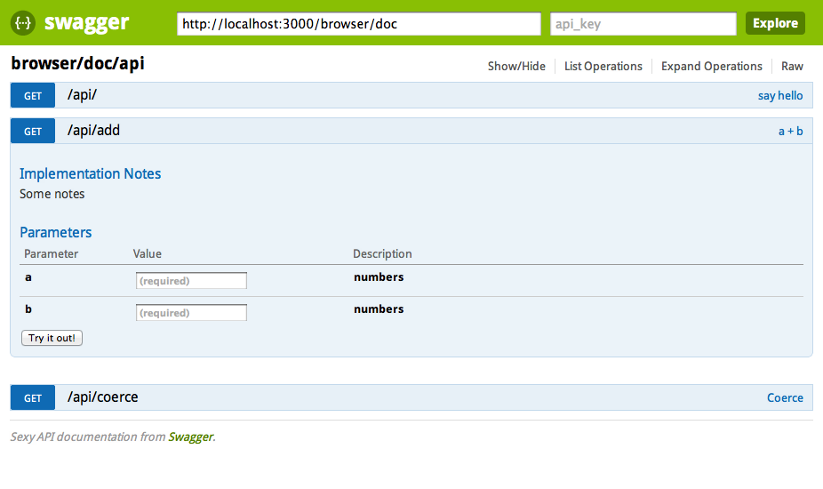

# What is it ?

An api browser for your grape services.



This works well for basics services, you will certainly run into problems when using
more complex services with the api query tool but the documentation should still work.

# Usage

There is a complete example in the example folder but here is the quick howto:

```ruby
require 'grape'
require 'grape/apidoc'

class TestAPI < Grape::API
  # ...
end

# the api browser will be accessible at /browser/index.html
Grape::Apidoc::Browser.setup(self, :root_path => '/browser') do |g|
  # /api is where the api can be accessed
  g.add_grape_api('/api', TestAPI)
end

map '/api' do
  run TestAPI
end
```

# Next Steps

There are some things I want to do:

- cleanup the code a bit: there is not so much code but this really looks like a mess
  (the whole thing was a quick experiment at first and I think it stills shows)

- add the type into the ui (I checked the swagger-ui code but I ran away)
- check other alternatives for swagger-ui if any (I think the project is a lot more complex then what it could be)


# License

See the LICENSE file for my code.
The included Swagger-ui code is released under the Apache License v2.0 and copyrighted by Wordnik.

